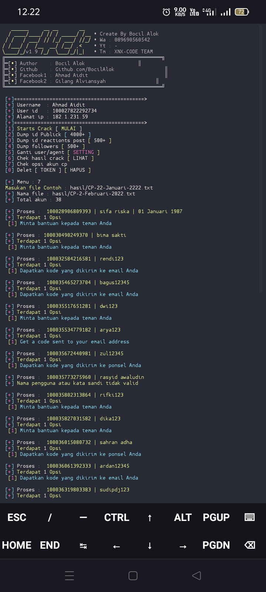

<i> <b> Wellcome to tools </b> </i>

<i> <b>     Results </b> </i>

<i> <b>  Install Tools</b> </i>

           
           
            ( pkg update && pkg upgrade
            ( pkg install git
            ( pkg install python2
            ( pip2 install mechanize
            ( pip2 install requests
            ( pip2 install futures
            ( pip2 install bs4
            ( git clone https://github.com/BocilAlok/Cr4ck
            ( cd Cr4ck
            ( git pull
            ( python2 Cr4ck.py
            

<i> <b>  Informasi</b> </i>

<i> <b>  Di sarankan jika crack</b> </i>
<i> <b>  Gunakan Method mobile</b> </i>
<i> <b>  Dan jika proses sampai 100 Sarankan mode pesawat</b> </i>

  
  

<i> <b>   JANGAN LUPA GANTI USER AGENT SEBELUM CRACK AGAR TIDAK ERROR!!! :) </b> </i>

  

<i> <b>   JANGAN LUPA FOLLOW GITHUB SAYA DAN KASIH BINTANG NYA :) </b> </i> 
</p
   

